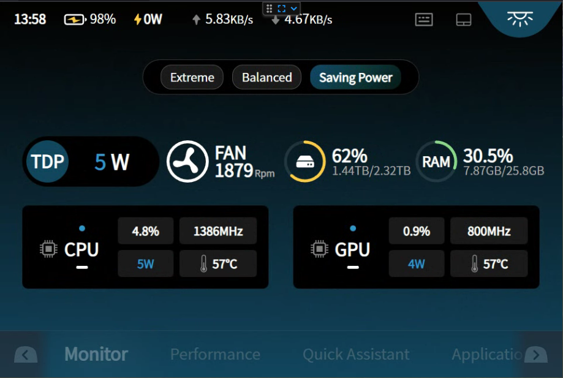
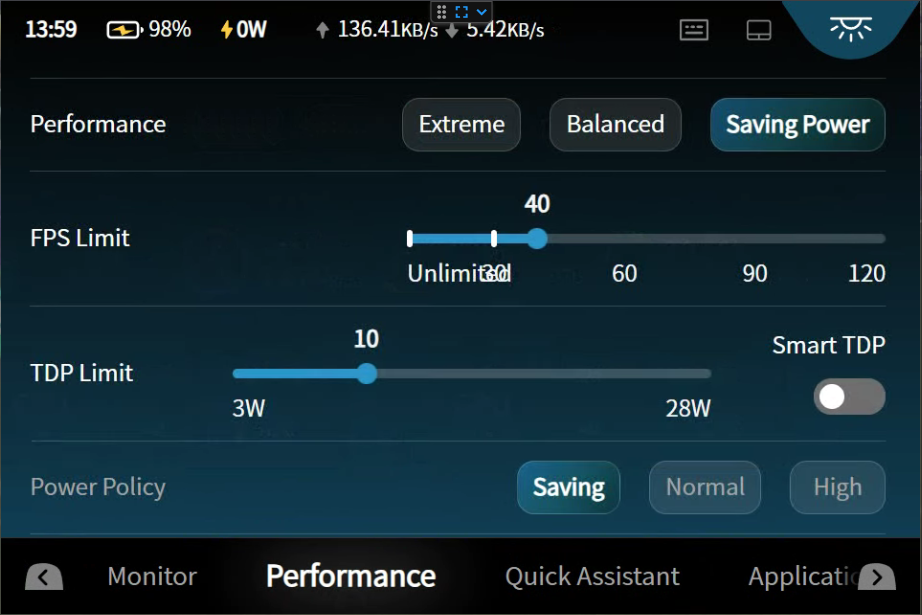

# AyaNeoFlipDSSubScreenColourChanger

Simple application to scan js files in Ayaspace and replace some colour codes to update the appearance of the bottom screen on the Ayaneo Flip DS.

Assuming your Ayaspace is installed as the default (C:\Program Files (x86)\AYASpace) you will likely need to run the application as administrator otherwise it won't have permission to replace the files, it SHOULD do a backup before modifying anything but if you want to be 100% sure backup the C:\Program Files (x86\\AYASpace\frontend\js folder first.

Run the application on your Flip DS, default values will set the screen to the values I use (a light blue/cyan) but all values can be customised, you need to use Hex colour codes and RGB colour codes, can use https://htmlcolorcodes.com/color-picker/ to get your codes.

Some Screenshots below:

