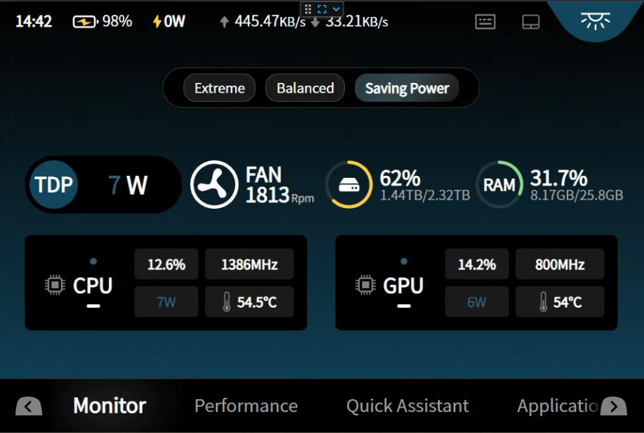
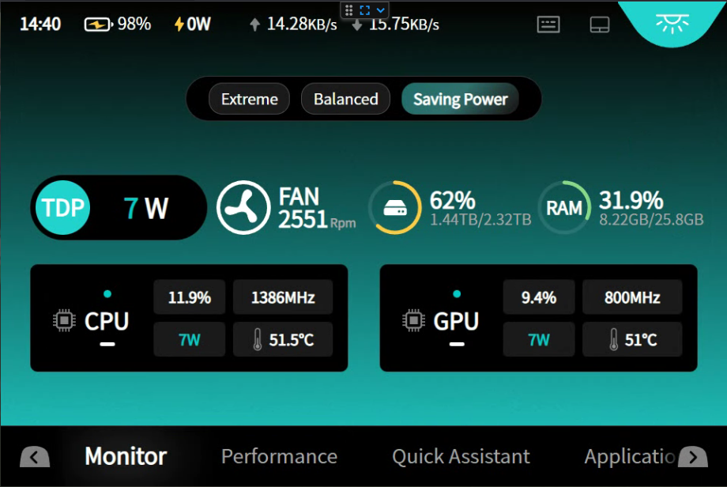
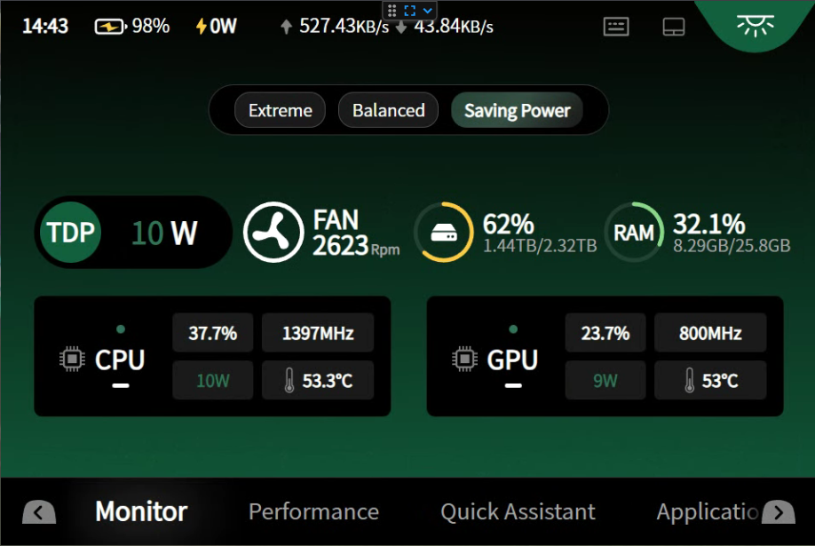
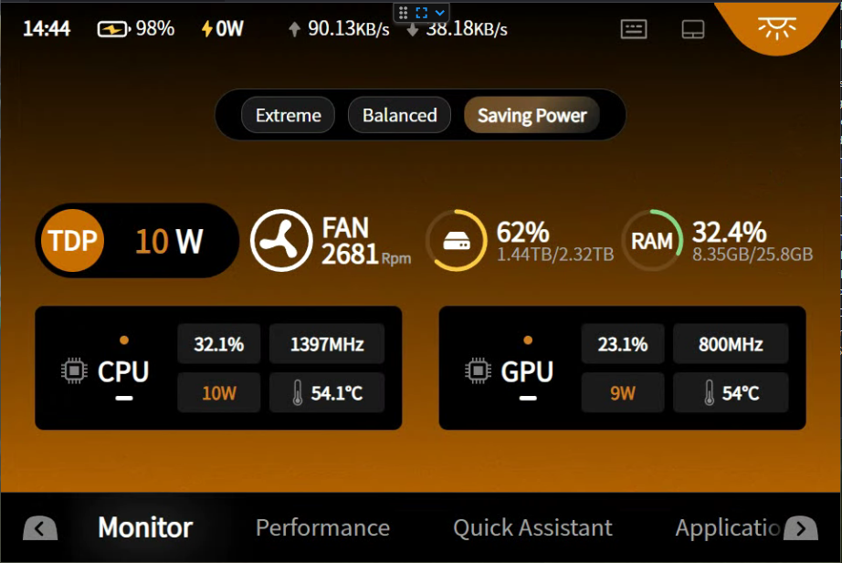
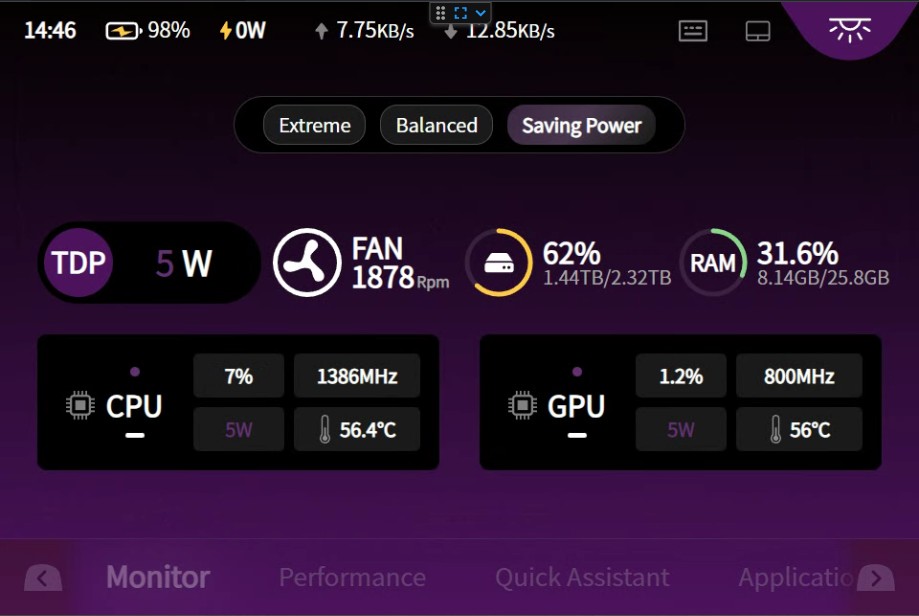

# AyaNeoFlipDSSubScreenColourChanger

Simple application to scan js files in Ayaspace and replace some colour codes to update the appearance of the bottom screen on the Ayaneo Flip DS.

Assuming your Ayaspace is installed as the default (C:\Program Files (x86)\AYASpace) you will likely need to run the application as administrator otherwise it won't have permission to replace the files, it SHOULD do a backup before modifying anything but if you want to be 100% sure backup the C:\Program Files (x86\\AYASpace\frontend\js folder first.

Run the application on your Flip DS, default values will set the screen to the values I use (a light blue/cyan) but all values can be customised, you need to use Hex colour codes and RGB colour codes, can use https://htmlcolorcodes.com/color-picker/ to get your codes.

If you have everything setup as default you can also use the provided batch files (please run as Admin) to set some colours I've chosen, otherwise you can either run as a command line with some arguments provided as below or just run the exe and the cli will attempt to help you through:

Can download from the Releases side bar or by clicking [here](https://github.com/JohnCannon87/AyaNeoFlipDSSubScreenColourChanger/releases/latest)
```batch
SubScreenColourChanger.exe <Background Hex Code> <Text Hex Code> <TDP Icon Hex Code> "<Gradient Value 1>" "<Gradient Value 2>" "<Gradient Value 3>"
```
e.g.
```batch
SubScreenColourChanger.exe #12455f #305C73 #12455f "77 116 135" "107 139 155" "59 59 59"
```

Do NOT forget the quotes around the rgb codes otherwise you will get an error message when the format is checked.


Screenshots below of the example colours in the provided batch files:

## Blue

## Cyan

## Green

## Orange

## Purple

